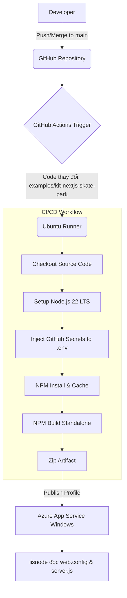

# 🎨 DESIGN: Architecture CI/CD Pipeline Next.js -> Azure Windows

Ngày tạo: 2026-04-01
Dựa trên: `docs/BRIEF.md` và Plan `260401-1659-azure-cicd-pipeline`

---

## 1. Cấu trúc hệ thống (Kiến trúc Pipeline)

## 2. Danh Sách File Cần Tác Động

| # | File / Thư mục | Mục đích | Thay đổi cụ thể |
|---|----------------|----------|-----------------|
| 1 | `.github/workflows/deploy-azure.yml` | File định nghĩa toàn bộ workflow CI/CD | Tạo mới |
| 2 | `examples/kit-nextjs-skate-park/next.config.ts` | Ép Next.js bundle gọn nhẹ | Thêm `output: 'standalone'` |
| 3 | `examples/kit-nextjs-skate-park/web.config` | Hướng dẫn Azure server chạy app | Tạo mới (URL Rewrite Rule sang `server.js`) |

## 3. Luồng Hoạt Động (CI/CD Journey)

1. **Trigger:** Kích hoạt ngầm định khi check thấy có thay đổi ở nhánh `main` và trong thư mục `examples/kit-nextjs-skate-park`.
2. **Build Environment:** Khởi tạo vùng làm việc (worker) bằng Ubuntu, trỏ thẳng working-directory vào thư mục dự án.
3. **Môi Trường (Vars):** Gọi 4 biến từ GitHub Secrets và inject vào file `.env.production` local để build.
4. **Build NextJS:** Dùng `npm run build` tạo thư mục `standalone/` (đóng gói sẵn `node_modules` và codebase) để tương thích môi trường server.
5. **Package:** Gom rọi `standalone/`, folder `public/`, `.next/static/` và `web.config` thành file `release.zip`.
6. **Deploy:** Bắn `release.zip` lên Azure thông qua action triển khai chuẩn của Microsoft với `AZUREAPPSERVICE_PUBLISHPROFILE`.

## 4. Checklist Kiểm Tra & Test Cases

### Kịch bản Tester: Kiểm thử luồng CI/CD
- [ ] Điều kiện 1: Push file readme vào ngoài thư mục `examples/kit-nextjs-skate-park` -> Pipeline KHÔNG kích hoạt.
- [ ] Điều kiện 2: Push code vào source app trên `main` -> Pipeline tự động Trigger.
- [ ] Điều kiện 3: Xem log build không bị lộ các String secret (Sitecore_ID...).
- [ ] Điều kiện 4: Sau khi báo Success, vào đường dẫn Azure Web App hiển thị đúng trang chủ thay vì lỗi "HTTP Error 500.xxxx".

---
*Tạo bởi AWF 2.1 - Design Phase*
