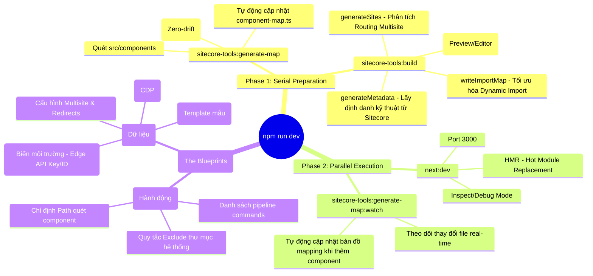

# Case Study: Sitecore Content SDK & Next.js Workflow Analysis

## 1. Tổng quan dự án (Project Overview)
Dự án **Kit Next.js Skate Park** là một ứng dụng web xây dựng trên nền tảng **Next.js (App Router)** tích hợp với **Sitecore Content SDK**. Dự án sử dụng mô hình xây dựng hiện đại, tự động hóa việc kết nối giữa CMS và Codefront-end.

---

## 2. Mind Map: Quy trình khởi động & Tự động hóa

---

## 3. Phân tích Luồng Khởi động (Deep Dive into `npm run dev`)
Khi thực thi lệnh phát triển, hệ thống không chỉ chạy server Next.js mà còn thực hiện một chuỗi các bước chuẩn bị (Pre-build) để đảm bảo tính đồng bộ dữ liệu.

### 🔄 Sơ đồ quy trình (Execution Flow)
Lệnh thực thi chính:
`npm-run-all --serial sitecore-tools:generate-map sitecore-tools:build --parallel next:dev sitecore-tools:generate-map:watch`

1.  **Giai đoạn Chuẩn bị (Serial - Chạy lần lượt):**
    *   **Step 1: `generate-map`**: Quét thư mục `src/components` để tự động hóa việc đăng ký component với Sitecore.
    *   **Step 2: `build`**: Khởi tạo các "nguyên liệu" (metadata, sites, dynamic imports) cần thiết cho SDK.

2.  **Giai đoạn Thực thi (Parallel - Chạy đồng thời):**
    *   **Next Server**: Khởi động môi trường dev của Next.js (Port 3000).
    *   **Watcher**: Theo dõi thay đổi trong thư mục component để cập nhật bản đồ mapping ngay lập tức.

---

## 3. Các Thành phần Công cụ (Sitecore CLI Tools)

### A. Tự động hóa Mapping (`sitecore-tools:generate-map`)
*   **Chức năng:** Tự động tạo/cập nhật file `.sitecore/component-map.ts`.
*   **Lợi ích:** Loại bỏ việc phải `import` và thêm component vào `Map` thủ công. Giúp đồng bộ tên component trên CMS và code một cách tuyệt đối (Zero-drift).

### B. Xây dựng cốt lõi (`sitecore-tools:build`)
Bao gồm 4 tiến trình con được định nghĩa trong `sitecore.cli.config.ts`:
1.  **`generateMetadata()`**: Tạo file định danh cấu trúc dự án cho SDK.
2.  **`generateSites()`**: Cấu hình cơ chế Routing giữa các trang web (Multisite support).
3.  **`extractFiles()`**: Trích xuất các tài nguyên của hệ thống (Preview mode, Editor tools).
4.  **`writeImportMap()`**: Tối ưu hóa hiệu năng bằng cách cho phép ứng dụng chỉ load component khi cần thiết (Dynamic Imports).

---

## 4. Tệp Cấu hình Trung tâm (`sitecore.cli.config.ts`)
Đây là "bản thiết kế" cho toàn bộ quá trình tự động hóa:
*   Định nghĩa thư mục quét component (`src/components`).
*   Thiết lập danh sách các lệnh build cần chạy.
*   Quản lý các trường hợp ngoại lệ (Excludes) để tránh lỗi hệ thống.

---

## 5. Kết luận & Bài học nghiên cứu (Key Findings)
*   **Tính Tự động hóa cao:** Việc sử dụng `sitecore-tools` giúp giảm 90% công việc cấu hình lặp lại khi tạo component mới.
*   **Khả năng Mở rộng (Scalability):** Hệ thống multisite và dynamic import map đảm bảo hiệu năng tối ưu ngay cả khi dự án có hàng trăm component.
*   **Trải nghiệm Nhà phát triển (DX):** Sự kết hợp giữa `serial` chuẩn bị và `parallel` thực thi + `watch` mode tạo ra vòng lặp phát triển cực nhanh (Hot Reloading).

---

## 6. Cấu trúc thư mục dự án (Project Structure)

Hệ thống được tổ chức theo mô hình **Modular & Clean Architecture**, giúp tách biệt giữa cấu hình, logic xử lý và giao diện người dùng.

### 📁 Thư mục gốc (Root Config)
| File/Folder | Chức năng |
| :--- | :--- |
| `.env` | Lưu trữ API Keys, Context IDs (Dành cho môi trường local). |
| `sitecore.config.ts` | Cấu hình trung tâm cho SDK (Edge URL, Site mặc định, CDP). |
| `sitecore.cli.config.ts` | Điều khiển các công cụ CLI (Generate Map, Build Pipeline). |
| `tailwind.config.js` | Định nghĩa Design System (Theme, Colors, Layout). |
| `next.config.ts` | Tối ưu hóa hiệu năng, Images domain và Routing của Next.js. |

### 📁 Thư mục `src/app` (Next.js Application)
| File/Path | Chức năng |
| :--- | :--- |
| `[locale]/layout.tsx` | Khung giao diện chung cho toàn bộ trang web (Đa ngôn ngữ). |
| `[locale]/[[...path]]` | **Dynamic Route**: Cầu nối quan trọng nhất, nạp dữ liệu từ CMS theo URL. |
| `favicon.ico` | Biểu tượng website trên trình duyệt. |

### 📁 Thư mục `src/components` (UI Components)
Nơi chứa toàn bộ linh hồn của Front-end. Mỗi thư mục con đại diện cho một thành phần trên CMS (ví dụ: `MenuHeaderBar`, `HeroBanner`). Các thay đổi tại đây được tự động theo dõi bởi `generate-map:watch`.

### 📁 Thư mục hỗ trợ (`src/lib`, `src/i18n`, `src/assets`)
*   **`src/lib`**: Khởi tạo kết nối Client và định nghĩa Typescript Interfaces cho dữ liệu Sitecore.
*   **`src/i18n`**: Xử lý logic đa ngôn ngữ và routing theo mã vùng (Ví dụ: `/en`, `/vi`).
*   **`src/assets`**: Chứa CSS gốc (v4), Images, và Fonts của dự án.
*   **`middleware.ts`**: Chạy trước mọi request để xử lý Redirects và bảo mật.

---

## 7. Công nghệ xử lý CSS (PostCSS vs SCSS)

Dự án sử dụng **PostCSS** làm bộ xử lý CSS chính thay vì SCSS/SASS truyền thống để tối ưu hóa hiệu năng và tương thích tốt nhất với Tailwind CSS v4.

### 🛠️ PostCSS (Hậu xử lý - Post-processor)
*   **Tệp cấu hình:** `postcss.config.mjs`.
*   **Cơ chế:** Nhận CSS chuẩn ➡️ Chạy qua các Plugins (như `@tailwindcss/postcss`) ➡️ Tạo ra CSS tối ưu cho trình duyệt.
*   **Lợi ích:** Tốc độ biên dịch cực nhanh, hỗ trợ các tính năng CSS hiện đại nhất (CSS Next).

### ⚖️ So sánh PostCSS và SCSS

| Đặc điểm | SASS/SCSS | PostCSS (Dự án hiện tại) |
| :--- | :--- | :--- |
| **Bản chất** | Pre-processor (Tiền xử lý) | Post-processor (Hậu xử lý) |
| **Cú pháp** | Ngôn ngữ riêng (`$`, `@mixin`) | CSS chuẩn hoặc CSS mở rộng |
| **Tích hợp Tailwind** | Thủ công, đôi khi xung đột | Tích hợp sâu, là "cặp bài trùng" |
| **Hiệu năng** | Chậm hơn khi quy mô lớn | Tối ưu hóa theo từng plugin, rất nhanh |

### 💡 Tại sao dự án này chọn PostCSS?
1.  **Tailwind v4 Optimized:** Tailwind v4 được thiết kế đặc biệt để chạy qua PostCSS Engine, giúp xử lý hàng ngàn class tiện ích trong tích tắc.
2.  **Zero-runtime CSS:** Mọi xử lý diễn ra lúc build, kết quả trả về trình duyệt là file CSS tĩnh, nhẹ và sạch sẽ.
3.  **Hỗ trợ tương lai:** Dễ dàng thêm các plugin như `autoprefixer` để tự động tương thích với các trình duyệt cũ.

---
*Tài liệu được biên soạn bởi Antigravity AI - 2026*
