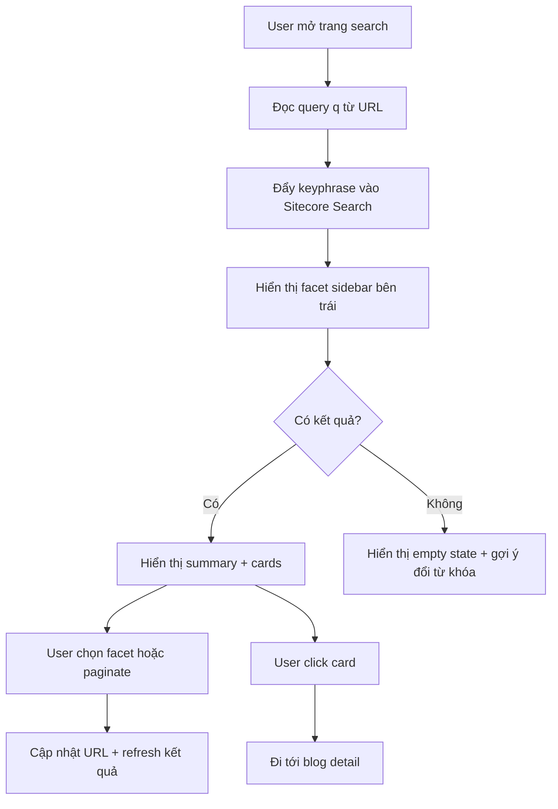

# Spec: Sitecore AI Blog Search Page

## 1. Executive Summary
Thiết kế một trang search blog mới cho dự án Skate Park dùng Sitecore Search làm engine chính. Trang này là nơi người dùng tìm bài viết nhanh, lọc theo các nhóm nội dung quen thuộc, hiểu kết quả ngay, và đi tiếp sang trang blog detail mà không bị lạc hướng.

Phiên bản đầu nên tập trung vào 4 việc:
- Tìm theo từ khóa nhanh và ổn định
- Search chỉ trong phạm vi blog
- Lọc bằng facets ở cột trái
- Hiển thị kết quả rõ ràng, giàu ngữ cảnh

## 2. Problem Statement
Component hiện tại tại `src/components/search/SitecoreSearchResults.tsx` đã kết nối được với Sitecore Search, nhưng trải nghiệm còn rất cơ bản:
- Header và copy chưa đúng vai trò của một search page
- Card kết quả còn mỏng, chưa đủ hierarchy
- Chưa có layout 2 cột cho search blog
- Chưa có facet sidebar cho `Categories`, `BlogTags`, `PublishDate`, `Author`
- Chưa có loading skeleton, filter state, sort, pagination
- `rfkId` đang là placeholder
- Chưa thể hiện được lợi thế “AI search” ở mặt trải nghiệm

## 3. Recommended Direction
Đề xuất làm một **Blog Search Page**:
- Scope chỉ search blog
- Layout 2 cột trên desktop
- Cột trái là facet sidebar
- Cột phải là thanh tìm kiếm, summary, danh sách kết quả
- Thanh tìm kiếm nằm ở giữa phần nội dung cột phải để làm điểm nhấn chính

Lý do:
- Dễ hiểu với người dùng đọc nội dung
- Dễ triển khai từ component hiện có
- Phù hợp chính xác với scope bạn đã chốt

## 4. MVP Features
1. Search input đồng bộ với URL query `q`
2. Layout 2 cột: facet sidebar trái, results phải
3. Facets: `Categories`, `BlogTags`, `PublishDate`, `Author`
4. Search results list với blog card rõ ràng hơn
5. Loading, error, empty state hoàn chỉnh
6. Results summary: số lượng kết quả + từ khóa hiện tại
7. Sort cơ bản
8. Pagination hoặc load more

## 5. Nice-to-Have Sau MVP
1. AI suggestions khi đang gõ
2. Query suggestions khi không có kết quả
3. Featured article ở vị trí đầu
4. Recent searches cho người dùng quay lại
5. Highlight phần text match trong summary

## 6. User Stories
- Là khách hàng, tôi muốn gõ một từ khóa và thấy ngay những kết quả liên quan nhất.
- Là khách hàng, tôi muốn lọc theo category, tag, ngày đăng hoặc tác giả để đỡ phải lướt nhiều.
- Là khách hàng, tôi muốn biết hiện có bao nhiêu kết quả để quyết định có cần đổi từ khóa hay không.
- Là biên tập viên, tôi muốn page search này được gắn vào Sitecore như một component chuẩn.

## 7. UX Structure
### Search page nên có 5 vùng:
1. Search hero
2. Facet sidebar bên trái
3. Search input ở cột phải
4. Summary + results area
5. Empty/error/help area

### Layout đề xuất
- Desktop: 2 cột, trái cho facets, phải cho search + results
- Mobile: facets thu gọn hoặc đẩy lên trên, results nằm dưới

## 8. Logic Flow

## 9. UI Components
- `SearchHero`: tiêu đề, mô tả ngắn, hướng dẫn
- `SearchFacetSidebar`: sidebar trái cho `Categories`, `BlogTags`, `PublishDate`, `Author`
- `SearchForm`: input + submit
- `SearchSummaryBar`: tổng số kết quả, keyword hiện tại, sort
- `SearchResultsList`: danh sách kết quả
- `SearchResultCard`: ảnh, title, mô tả, publish date, author, CTA
- `SearchEmptyState`
- `SearchErrorState`
- `SearchSkeletonList`

## 10. Content & Copy Guidelines
- Title nên nói rõ user có thể tìm bài viết gì
- Empty state không nên chỉ nói “No results”
- Copy cần gợi ý hành động tiếp theo, ví dụ: thử từ khóa ngắn hơn, bỏ dấu, hoặc chọn category khác

## 11. Hidden Requirements
- Hỗ trợ dữ liệu field blog có thể không đồng nhất giữa các item
- Không làm hỏng navigation khi query string thay đổi
- Không crash nếu Sitecore Search env chưa được cấu hình
- Giữ URL shareable

## 12. Technical Notes
- Giữ component ở client side vì phụ thuộc widget hook
- Tiếp tục tận dụng `SitecoreSearchProvider`
- Scope hiện tại là blog-only nên có thể tối ưu card và facet theo blog
- `rfkId` cần lấy từ cấu hình hoặc rendering params thật

## 13. Out of Scope Cho /plan
- Thiết kế DB chi tiết
- API contract chi tiết
- Analytics schema chi tiết
- Prompt/AI ranking logic chi tiết

## 14. Build Checklist
- [ ] Chốt scope blog-only
- [ ] Chốt `rfkId`
- [ ] Dựng layout 2 cột
- [ ] Thêm facet sidebar: Categories, BlogTags, PublishDate, Author
- [ ] Làm lại shell của search page
- [ ] Làm card và states
- [ ] Thêm sort/filter/pagination phù hợp
- [ ] Kiểm tra responsive
- [ ] Kiểm tra fallback khi env search không có
- [ ] Review cùng content/editor team
